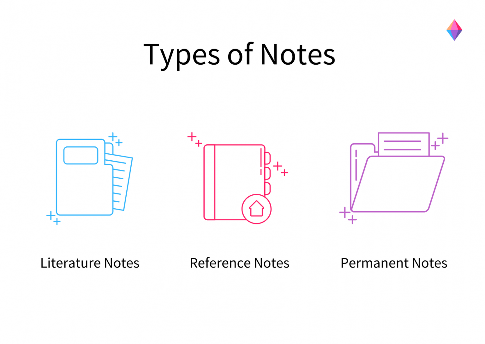

https://writingcooperative.com/zettelkasten-how-one-german-scholar-was-so-freakishly-productive-997e4e0ca125

https://medium.com/@fairylights_io/the-zettelkasten-method-examples-to-help-you-get-started-8f8a44fa9ae6

https://zenkit.com/en/blog/a-beginners-guide-to-the-zettelkasten-method/

https://www.youtube.com/watch?v=rOSZOCoqOo8
https://www.youtube.com/watch?v=GpV47rUYk8I

https://leananki.com/zettelkasten-method-smart-notes/
https://niklas-luhmann-archiv.de/nachlass/zettelkasten

https://medium.datadriveninvestor.com/boost-10x-learning-with-foam-7321b456f874

Observe reference note in image

https://www.youtube.com/watch?v=bP7AXjA4O6U

https://www.reddit.com/r/Zettelkasten/comments/b566a4/what_is_a_zettelkasten/

https://zettelkasten.de/posts/overview/

https://superorganizers.substack.com/p/how-to-build-a-learning-machine

## Foam

https://egghead.io/lessons/vs-code-create-a-second-brain-in-vscode-with-foam

https://zacjones.io/second-brain-with-foam

https://hodgkins.io/vscode-second-brain

https://github.com/zacjones93/my-brain

https://djon.es/blog/2020/07/06/designing-a-personal-memex-with-foam/

https://github.com/SanketDG/foam/tree/master/docs

https://jackiexiao.github.io/foam/recipes/creating-new-notes/

https://foambubble.github.io/foam/user/features/note-templates.html

https://foambubble.github.io/foam/user/features/daily-notes.html

https://foambubble.github.io/foam/user/frequently-asked-questions

https://foambubble.github.io/foam/user/recipes/recipes
https://foambubble.github.io/foam/user/recipes/web-clipper
https://foambubble.github.io/foam/user/getting-started/creating-new-notes

