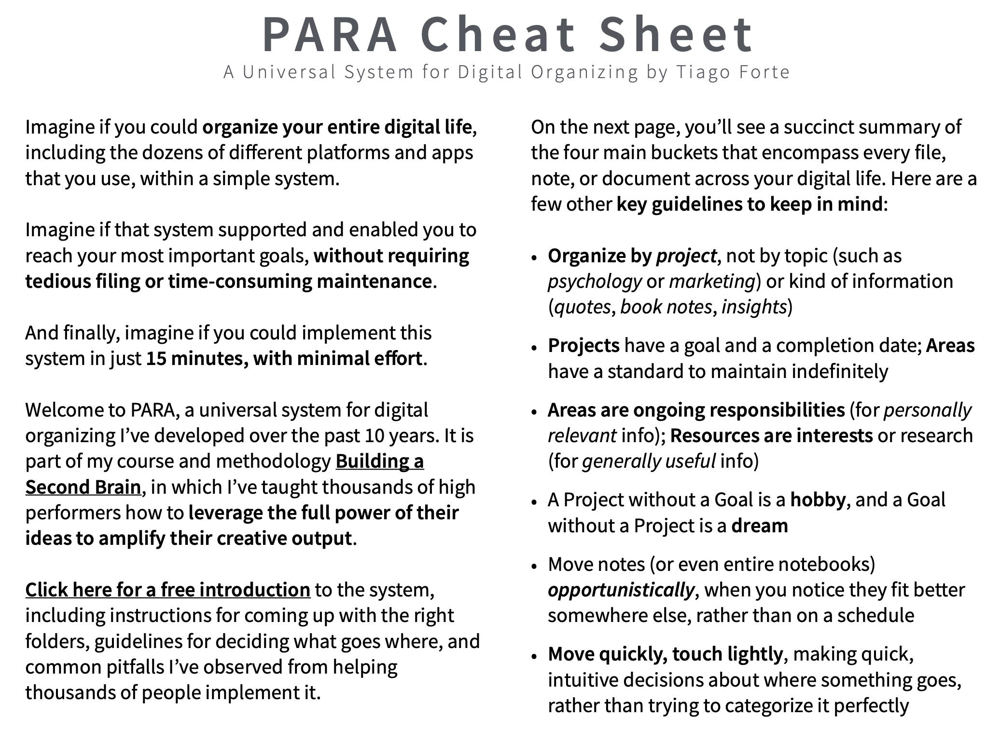
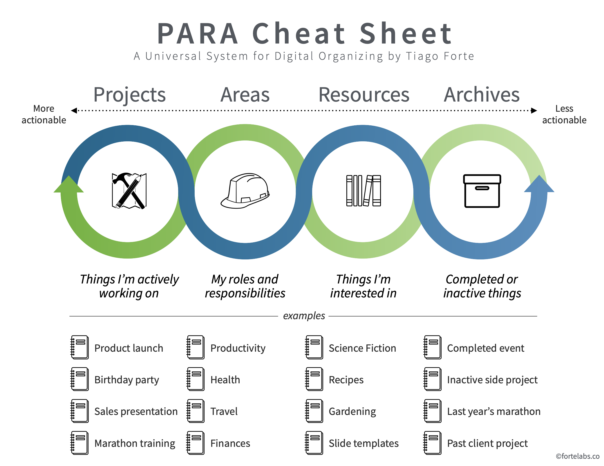
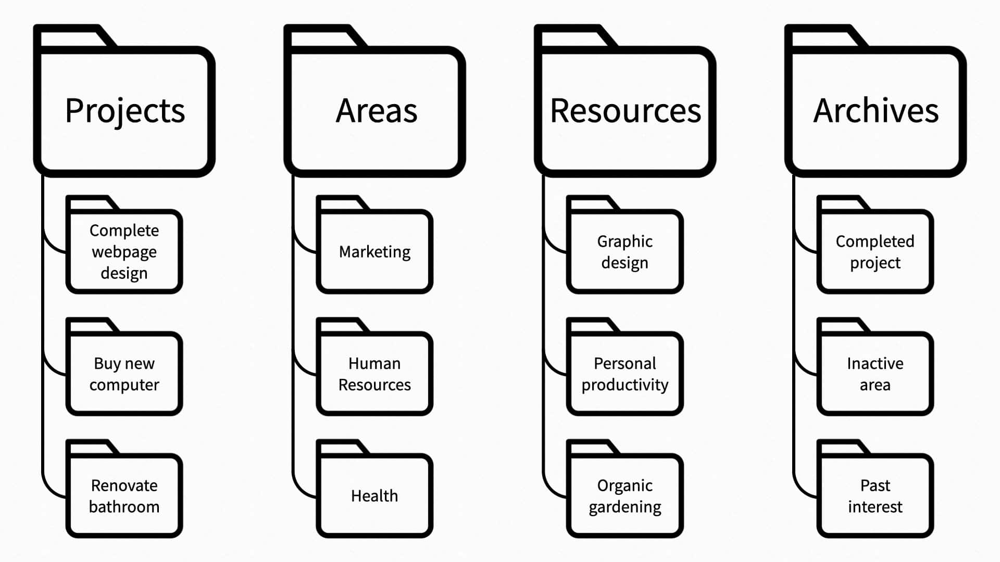

# Index

The purpose of this index is to share the entry points to the second brain. We will just keep 1-2 notes per topic/tag. 

https://attachments.convertkitcdnm.com/175313/574506e8-d187-4448-8442-1d022c02a73f/PARA_Cheat_Sheet.pdf

Projects: short-term efforts (in your work or personal life) that you take on with a certain goal in mind
for example:

Complete webpage design
Buy a new computer
Write research report
Renovate the bathroom
Finish Spanish language course
Set up new living room furniture

Areas: Long-term responsibilities you want to manage over time 

Work responsibilities such as Marketing, Human Resources, Product Management, Research and Development, Direct Reports, or Engineering
Personal responsibilities such as Health, Finances, Kids, Writing, Car, or Home

Resources: Topics or interests that may be useful in the future
Archive: Inactive items from the other 3 categories

The first step in building a Second Brain is “capturing” the ideas and insights you think are worth saving. Ask yourself:

What are the recurring themes and questions that I always seem to return to in my work and life?
What insightful, high-value, impactful information do I already have access to that could be valuable?
Which knowledge do I want to interconnect, mix and match, and periodically resurface to stimulate future thinking on these subjects?
While capturing information, 
your rule of thumb should be to save anything that “resonates” with you on an intuitive level. 

https://fortelabs.com/blog/para/

## Major interest areas

- [[tags_career]]    insights
- [[tags_datascience]]
- [[tags_investing]]
- [[tags_writing]]
- [[tags_life]] general useful things in life. insights
- [[python]]
- [[productivity]]

## Tags
Tech
python, system design, data science, machine learning, deep learning, statistics, data engineering, data visualization, data analysis, data analytics, data science,

Career
interview, salary negotitation, career, job search, resume, linkedin,

